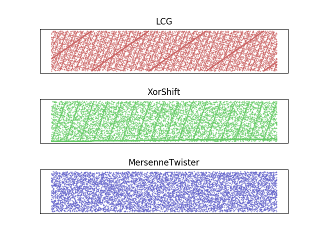

擬似乱数生成器
===========================

結論としてはこだわりがなければメルセンヌ・ツイスタを使うのが一番。
本当にそうなのか可視化して確認するために次のコードを書いた。

.. code-block:: python

    import random
    import time

    class LCG:
        def __init__(self, seed=None):
            self.seed = int(time.time() if seed is None else seed)

        def random(self):
            self.seed = self.seed * 1103515245 + 12345
            return self.seed // 65536 % 32768

    class XorShift:
        def __init__(self, seed=None):
            self.seed = int(time.time() if seed is None else seed)

        def random(self):
            x = self.seed
            x = x ^ (x << 13)
            x = x ^ (x >> 17)
            self.seed = (x ^ (x << 5)) & 0xffffffff
            return self.seed

    class MersenneTwister:
        def __init__(self, seed=None):
            self.rng = random.Random(seed)

        def random(self):
            return self.rng.random()

LCGのコードは `由来不明 <http://pubs.opengroup.org/onlinepubs/9699919799/functions/rand.html#tag_16_473_06_02>`_ の線形合同法の関数を実装したものである。
XorShiftは32bit版を、メルセンヌ・ツイスタはPython標準のrandomモジュールを使用している。

横軸は乱数のseed, 縦軸は生成された値である。生成器によってスケールが違うが特に問題はないと思われる。

LCGは最悪の乱数である。格子状に特徴的な模様が出て、さらに奇数と偶数が交互に出るのもよくない。
XorShiftは高速に動作するのがウリで、組み込みなどの計算能力の低い環境では有効だが、依然として特徴的な模様が出る。
メルセンヌ・ツイスタは素人目で見て適度に散らばっている。

もしメルセンヌ・ツイスタよりもよい乱数が欲しければ ``/dev/urandom`` を利用するのがよいだろう。
Pythonでは ``random.SystemRandom()`` を使える。
